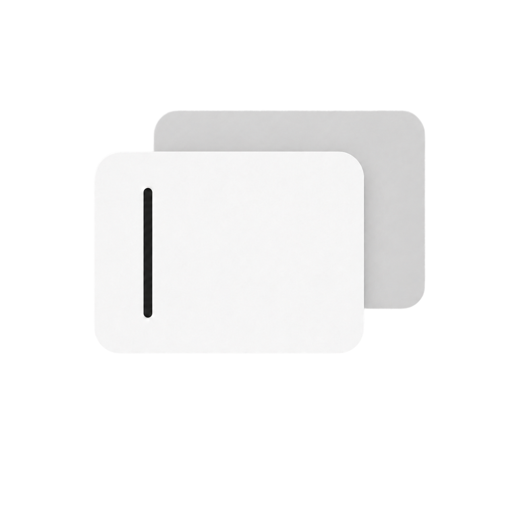

# ScreenNotepad

A lightweight floating notepad for macOS, summoned instantly with a global hotkey.

**The problem it solves:** In chat apps, messaging tools, and code editors, pressing Enter does different things — sometimes it sends, sometimes it inserts a newline. ScreenNotepad gives you a neutral scratchpad where Enter *always* means newline. Draft your text here, then copy it wherever you need.



---

## Features

- **Global hotkey** — default `F16`, fully customizable. Works even when another app is in fullscreen.
- **Persistent content** — text survives app restarts automatically.
- **Blur background** — semi-transparent frosted glass panel that floats above all windows.
- **Click outside to dismiss** — panel hides when you click away; hotkey brings it back with your text intact.
- **Toolbar actions** — clear, copy, or copy-and-clear in one click.
- **Customizable appearance** — background color, text color, and font size via the settings panel.
- **Home / End keys** — jump to the beginning or end of the current line.
- **Standard shortcuts** — ⌘A, ⌘C, ⌘V, ⌘X, ⌘Z, ⌘Y all work as expected.
- **No Dock icon** — lives quietly in the menu bar.

---

## Requirements

- macOS 13.0 or later
- Apple Silicon (arm64)
- Xcode Command Line Tools (`xcode-select --install`)

---

## Build & Install

```bash
git clone https://github.com/kestrel-coder/screen-notepad.git
cd screen-notepad
bash build.sh
```

This compiles the app, signs it with an ad-hoc signature, and installs it to `/Applications/ScreenNotepad.app`.

**First launch:** macOS will show a Gatekeeper warning because the app isn't notarized. Right-click the app → **Open** → **Open** to approve it once. Alternatively:

```bash
xattr -cr /Applications/ScreenNotepad.app
```

**Auto-start on login:** System Settings → General → Login Items → add `/Applications/ScreenNotepad.app`.

---

## Usage

| Action | How |
|---|---|
| Show / hide panel | `F16` (or your custom hotkey) |
| Dismiss panel | Click anywhere outside |
| Copy text | Click the copy icon in the toolbar |
| Copy and clear | Click the filled copy icon |
| Clear all text | Click the trash icon |
| Open settings | Click the gear icon |
| Move to line start | `Home` |
| Move to line end | `End` |

---

## Settings

Click the **gear icon** (bottom-left of the panel) to open settings:

- **Background color** — with opacity control
- **Text color**
- **Font size** — 10–32 pt
- **Hotkey** — click the button and press any key combination to record a new one

---

## Distributing to Others

To build a DMG for sharing:

```bash
bash build.sh --release
```

This creates `ScreenNotepad-v0.1.0.dmg` in the project folder. Recipients open the DMG and drag the app to their Applications folder. They'll need to approve the Gatekeeper prompt once on first launch.

> For fully seamless distribution (no Gatekeeper prompt), an Apple Developer account and notarization are required.

---

## Project Structure

```
screen-notepad/
├── Sources/
│   ├── main.swift                  entry point
│   ├── AppDelegate.swift           lifecycle, menu bar icon, hotkey registration
│   ├── FloatingPanel.swift         NSPanel subclass
│   ├── FloatingPanelController.swift  show/hide logic, outside-click detection
│   ├── HotkeyManager.swift         Carbon RegisterEventHotKey wrapper
│   ├── NotepadContent.swift        text content, UserDefaults persistence
│   ├── NotepadSettings.swift       appearance & hotkey settings, UserDefaults persistence
│   ├── NotepadView.swift           root SwiftUI view, blur background
│   ├── NoteTextView.swift          NSScrollView + NSTextView bridge
│   ├── ToolbarView.swift           bottom toolbar
│   └── SettingsView.swift          settings panel
├── Resources/
│   ├── logo.png                    source icon (1254×1254)
│   └── AppIcon.icns                compiled icon (all sizes)
├── Info.plist
├── ScreenNotepad.entitlements
└── build.sh                        build, sign, install, and optionally package DMG
```

---

## License

MIT
